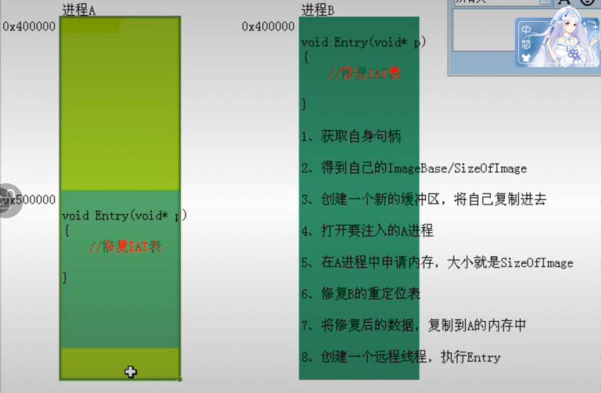
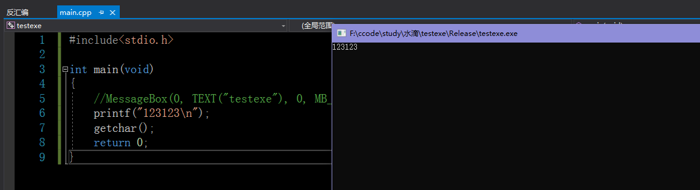
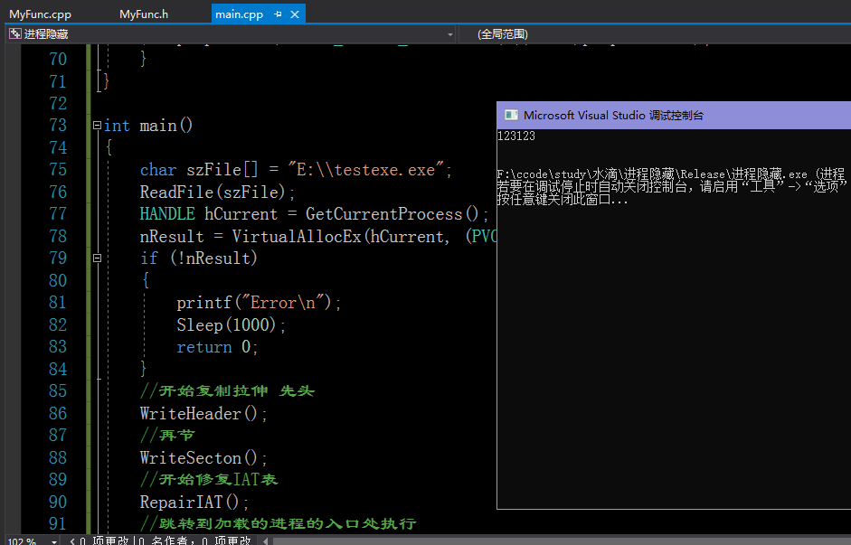

# 进程的执行

1. 通过context进行执行。

# 进程隐藏1

1. 新建B.exe将ImageBase调高 0x2000000(高空运行)。
2. 读取A.exe 拉伸、复制到0x400000。
3. 根据B.exe的导入表，修复A的IAT表。
   1. DLL的名字。
   2. 该DLL的函数名或者序号。
   3. IAT = GetProcessAddr(LoadLibary(DLL名称),函数名称或者函数序号)。
4. 调到A的入口处执行。

# 进程隐藏2

## 进程B

1. 创建一个函数Entry
   1. 修复进程B的IAT表
   2. 所谓的修复IAT表，不是把 412345 改成 512345 而是改 512345里面存的值。改512345是重定位表的任务。
   3. 需要把进程B用到的函数地址，改成A进程中的地址。
2. 获得自身的句柄。
3. 得到字节的ImageBase和SizeOfimage。
4. 创建一个新的缓冲区、将自己复制进去。
5. 打开要注入的A进程。
6. 在A进程中申请内存，大小B的是SizeOfImage。
7. 修复进程B的重定位表。（只要修复了重定位表，IAT表也就修复了）
8. 将复制后的数据，复制到A的内存中。
9. 创建一个远程线程执行进程B的Entry。



```c
//main.cpp
#include "MyFunc.h"

PIMAGE_DOS_HEADER pDosHeader = NULL;			//PE DOS头
PIMAGE_NT_HEADERS pNTHeaders = NULL;			//PE NT头
PIMAGE_FILE_HEADER pFileHeader = NULL;			//PE File头
PIMAGE_OPTIONAL_HEADER pOptionalHeader = NULL;	//PE 拓展文件头
PIMAGE_DATA_DIRECTORY pDirec = NULL;			//PE 目录
PIMAGE_SECTION_HEADER pSectionHeader = NULL;	//PE 节表
PVOID pFileBuffer;								//PE文件Buffer
PVOID nResult;									//

void ReadFile(PCSTR lParam)
{
	ReadPEFile(lParam, &pFileBuffer, 0);
	pDosHeader = (PIMAGE_DOS_HEADER)pFileBuffer;
	if (*((PDWORD)((DWORD)pDosHeader + pDosHeader->e_lfanew)) != IMAGE_NT_SIGNATURE)
	{
		printf("不是有效的PE文件，没有PE标记！\n");
		return;
	}
	pNTHeaders = (PIMAGE_NT_HEADERS)((DWORD)pDosHeader + pDosHeader->e_lfanew);
	pFileHeader = (PIMAGE_FILE_HEADER)((DWORD)pNTHeaders + 4);
	pOptionalHeader = (PIMAGE_OPTIONAL_HEADER)((DWORD)pFileHeader + IMAGE_SIZEOF_FILE_HEADER);
	pDirec = pOptionalHeader->DataDirectory;
	pSectionHeader = (PIMAGE_SECTION_HEADER)((DWORD)(pOptionalHeader)+pFileHeader->SizeOfOptionalHeader);
}

void WriteHeader()
{
	memcpy(nResult, pDosHeader, pOptionalHeader->SizeOfHeaders);
}

void WriteSecton()
{
	for (int i = 0; i < pFileHeader->NumberOfSections; i++)
	{
		PVOID DestLoc = (PVOID)((DWORD)nResult + (pSectionHeader + i)->VirtualAddress);
		PVOID SourLoc = (PVOID)((DWORD)pDosHeader + (pSectionHeader + i)->PointerToRawData);
		memcpy(DestLoc, SourLoc, (pSectionHeader + i)->SizeOfRawData);
	}
}

void RepairIAT()
{
	//修复IAT表
	PIMAGE_IMPORT_DESCRIPTOR pImport = (PIMAGE_IMPORT_DESCRIPTOR)((DWORD)nResult + (pDirec + 1)->VirtualAddress);
	while (pImport->Name != 0 && pImport->OriginalFirstThunk != 0)
	{
		PIMAGE_THUNK_DATA pINT = (PIMAGE_THUNK_DATA)(pImport->OriginalFirstThunk + (DWORD)nResult);
		PIMAGE_THUNK_DATA pIAT = (PIMAGE_THUNK_DATA)(pImport->FirstThunk + (DWORD)nResult);
		while (pINT->u1.AddressOfData != 0 && pIAT->u1.AddressOfData != 0)
		{
			if (pINT->u1.AddressOfData < IMAGE_ORDINAL_FLAG32)
			{
				char* DllName = (char*)((DWORD)nResult + pImport->Name);
				char* FuncName = ((PIMAGE_IMPORT_BY_NAME)((DWORD)nResult + pINT->u1.AddressOfData))->Name;
				pIAT->u1.AddressOfData = (DWORD)GetProcAddress(LoadLibraryA(DllName), FuncName);
			}
			else
			{
				char* DllName = (char*)((DWORD)nResult + pImport->Name);
				DWORD TEMP = pINT->u1.AddressOfData << 1;
				DWORD Low31 = TEMP >> 1;
				pIAT->u1.AddressOfData = (DWORD)GetProcAddress(LoadLibraryA(DllName), (LPCSTR)Low31);
			}
			pINT++;
			pIAT++;
		}
		pImport = (PIMAGE_IMPORT_DESCRIPTOR)((DWORD)pImport + 20);
	}
}

int main()
{
	char szFile[] = "E:\\testexe.exe";
	ReadFile(szFile);
	HANDLE hCurrent = GetCurrentProcess();
	nResult = VirtualAllocEx(hCurrent, (PVOID)pOptionalHeader->ImageBase, pOptionalHeader->SizeOfImage, MEM_COMMIT | MEM_RESERVE, PAGE_EXECUTE_READWRITE);
	if (!nResult)
	{
		printf("Error\n");
		Sleep(1000);
		return 0;
	}
	//开始复制拉伸 先头
	WriteHeader();
	//再节
	WriteSecton();
	//开始修复IAT表
	RepairIAT();
	//跳转到加载的进程的入口处执行
	DWORD EntryPoint = (DWORD)nResult + pOptionalHeader->AddressOfEntryPoint;
	HANDLE hThread = GetCurrentThread();
	CONTEXT cont;
	cont.ContextFlags = CONTEXT_FULL;
	GetThreadContext(hThread, &cont);
	cont.Eip = EntryPoint;
	cont.Eax = EntryPoint;
	char* ImageBaseA = (char*)(cont.Ebx + 8);
	memcpy(ImageBaseA, &pOptionalHeader->ImageBase, 4);
	cont.ContextFlags = CONTEXT_FULL;
	SetThreadContext(hThread, &cont);

	return 0;
}
```

```c
//MyFunc.cpp
#include "MyFunc.h"

DWORD ReadPEFile(IN LPCSTR FileName, OUT LPVOID* pFileBuffer, IN DWORD NewNumber)
{
	LPVOID pTempFileBuffer = NULL;
	FILE* pFile = NULL;
	pFile = fopen(FileName, "rb");
	if (pFile == NULL)
	{
		printf("Open File Failure!\n");
		return NULL;
	}
	fseek(pFile, 0, SEEK_END);
	long size = ftell(pFile);
	rewind(pFile);
	pTempFileBuffer = malloc(size + NewNumber);
	if (pTempFileBuffer == NULL)
	{
		printf("FileBuffer空间申请失败！\n");
		fclose(pFile);
		return NULL;
	}
	memset(pTempFileBuffer, 0, size + NewNumber);
	if (fread(pTempFileBuffer, size, 1, pFile) == 0)
	{
		printf("读取文件内容到缓冲区失败！\n");
		fclose(pFile);
		free(pTempFileBuffer);
		return NULL;
	}
	fclose(pFile);
	*pFileBuffer = pTempFileBuffer;
	pTempFileBuffer = NULL;
	return size + NewNumber;
}


DWORD CopyFileBufferToImageBuffer(IN LPVOID pFileBuffer, OUT LPVOID* pImageBuffer)
{
	LPVOID pTempImageBuffer = NULL;
	PIMAGE_DOS_HEADER pDosHeader = NULL;
	PIMAGE_NT_HEADERS pNTHeaders = NULL;
	PIMAGE_FILE_HEADER pFileHeader = NULL;
	PIMAGE_OPTIONAL_HEADER pOptionalHeader = NULL;
	PIMAGE_SECTION_HEADER pSectionHeader = NULL;
	if (pFileBuffer == NULL)
	{
		printf("文件缓冲区指针无效！\n");
		return NULL;
	}
	if (*((PWORD)pFileBuffer) != IMAGE_DOS_SIGNATURE)
	{
		printf("文件缓冲区不是有效的PE文件,没有MZ标记！\n");
		return NULL;
	}
	pDosHeader = (PIMAGE_DOS_HEADER)pFileBuffer;
	if (*((PDWORD)((DWORD)pDosHeader + pDosHeader->e_lfanew)) != IMAGE_NT_SIGNATURE)
	{
		printf("不是有效的PE文件，没有PE标记！\n");
		return NULL;
	}
	pNTHeaders = (PIMAGE_NT_HEADERS)((DWORD)pDosHeader + pDosHeader->e_lfanew);
	pFileHeader = (PIMAGE_FILE_HEADER)((DWORD)pNTHeaders + 4);
	pOptionalHeader = (PIMAGE_OPTIONAL_HEADER)((DWORD)pFileHeader + IMAGE_SIZEOF_FILE_HEADER);
	pSectionHeader = (PIMAGE_SECTION_HEADER)((DWORD)(pOptionalHeader)+pFileHeader->SizeOfOptionalHeader);
	long SizeOfImage = pOptionalHeader->SizeOfImage;
	pTempImageBuffer = malloc(SizeOfImage);
	if (pTempImageBuffer == NULL)
	{
		printf("ImageBuffer空间申请失败！\n");
		return NULL;
	}
	//将申请的内存全部置为零
	memset(pTempImageBuffer, 0, SizeOfImage);
	//开始读数据（头部）
	memcpy(pTempImageBuffer, pDosHeader, pOptionalHeader->SizeOfHeaders);
	//开始读数据（节）
	PIMAGE_SECTION_HEADER pTempSectionHeader = pSectionHeader;
	for (int i = pFileHeader->NumberOfSections; i > 0; i--, pTempSectionHeader++)
	{
		memcpy((LPVOID)((DWORD)pTempImageBuffer + pTempSectionHeader->VirtualAddress), (LPVOID)((DWORD)pDosHeader + pTempSectionHeader->PointerToRawData), pTempSectionHeader->SizeOfRawData);
	}
	*pImageBuffer = pTempImageBuffer;
	pTempImageBuffer = NULL;
	return SizeOfImage;
}


DWORD CopyImageBufferToNewBuffer(IN LPVOID pImageBuffer, OUT LPVOID* pNewBuffer)
{
	LPVOID pTempNewBuffer = NULL;
	PIMAGE_DOS_HEADER pDosHeader = NULL;
	PIMAGE_NT_HEADERS pNTHeaders = NULL;
	PIMAGE_FILE_HEADER pFileHeader = NULL;
	PIMAGE_OPTIONAL_HEADER pOptionalHeader = NULL;
	PIMAGE_SECTION_HEADER pSectionHeader = NULL;
	if (pImageBuffer == NULL)
	{
		printf("映像缓冲区指针无效！\n");
		return NULL;
	}
	if (*((PWORD)pImageBuffer) != IMAGE_DOS_SIGNATURE)
	{
		printf("映像缓冲区不是有效的PE文件,没有MZ标记！\n");
		return NULL;
	}
	pDosHeader = (PIMAGE_DOS_HEADER)pImageBuffer;
	if (*((PDWORD)((DWORD)pDosHeader + pDosHeader->e_lfanew)) != IMAGE_NT_SIGNATURE)
	{
		printf("映像缓冲区不是有效的PE文件，没有PE标记！\n");
		return NULL;
	}
	pNTHeaders = (PIMAGE_NT_HEADERS)((DWORD)pDosHeader + pDosHeader->e_lfanew);
	pFileHeader = (PIMAGE_FILE_HEADER)((DWORD)pNTHeaders + 4);
	pOptionalHeader = (PIMAGE_OPTIONAL_HEADER)((DWORD)pFileHeader + IMAGE_SIZEOF_FILE_HEADER);
	pSectionHeader = (PIMAGE_SECTION_HEADER)((DWORD)(pOptionalHeader)+pFileHeader->SizeOfOptionalHeader);
	//判断需要多大的NewBuffer
	PIMAGE_SECTION_HEADER pTempSectionHeader = pSectionHeader;
	size_t ii = pFileHeader->NumberOfSections;
	while (ii > 1)
	{
		pTempSectionHeader++;
		ii--;
	}
	long SizeOfNewBuffer = (DWORD)pTempSectionHeader->PointerToRawData + pTempSectionHeader->SizeOfRawData;
	pTempNewBuffer = malloc(SizeOfNewBuffer);
	if (pTempNewBuffer == NULL)
	{
		printf("新文件缓冲区空间申请失败！\n");
		return NULL;
	}
	memset(pTempNewBuffer, 0, SizeOfNewBuffer);
	memcpy(pTempNewBuffer, pDosHeader, pOptionalHeader->SizeOfHeaders);
	PIMAGE_SECTION_HEADER  pTempSectionHeaderTwo = pSectionHeader;
	for (int i = pFileHeader->NumberOfSections; i > 0; i--, pTempSectionHeaderTwo++)
	{
		memcpy((LPVOID)((DWORD)pTempNewBuffer + pTempSectionHeaderTwo->PointerToRawData), (LPVOID)((DWORD)pDosHeader + pTempSectionHeaderTwo->VirtualAddress), pTempSectionHeaderTwo->SizeOfRawData);
	}
	*pNewBuffer = pTempNewBuffer;
	pTempNewBuffer = NULL;
	return SizeOfNewBuffer;
}

BOOL CopyMemoryToFile(IN LPVOID pMemBuffer, IN size_t Size, IN LPCSTR FileName)
{
	FILE* pFile = NULL;
	if (pMemBuffer == NULL)
	{
		printf("内存缓冲区无效！\n");
		return NULL;
	}
	pFile = fopen(FileName, "wb");
	if (pFile == NULL)
	{
		printf("打开指定的文件失败！\n");
		return NULL;
	}
	if (fwrite(pMemBuffer, Size, 1, pFile) != 0)
	{
		printf("存盘成功\n");
	}
	fclose(pFile);
	return Size;
}

DWORD Rva2Foa(IN DWORD Rva, IN LPVOID pFileBuffer)
{
	DWORD FileOffsetAddress = NULL;
	DWORD Offset = NULL;
	LPVOID pTempFileBuffer = NULL;
	PIMAGE_DOS_HEADER pDosHeader = NULL;
	PIMAGE_NT_HEADERS pNTHeaders = NULL;
	PIMAGE_FILE_HEADER pFileHeader = NULL;
	PIMAGE_OPTIONAL_HEADER pOptionalHeader = NULL;
	PIMAGE_SECTION_HEADER pSectionHeader = NULL;
	if (pFileBuffer == NULL)
	{
		printf("文件缓冲区无效！\n");
		return NULL;
	}
	pTempFileBuffer = pFileBuffer;

	if (*((PWORD)pTempFileBuffer) != IMAGE_DOS_SIGNATURE)
	{
		printf("映像缓冲区不是有效的PE文件,没有MZ标记！\n");
		return NULL;
	}
	pDosHeader = (PIMAGE_DOS_HEADER)pTempFileBuffer;
	if (*((PDWORD)((DWORD)pDosHeader + pDosHeader->e_lfanew)) != IMAGE_NT_SIGNATURE)
	{
		printf("映像缓冲区不是有效的PE文件，没有PE标记！\n");
		return NULL;
	}
	pNTHeaders = (PIMAGE_NT_HEADERS)((DWORD)pDosHeader + pDosHeader->e_lfanew);
	pFileHeader = (PIMAGE_FILE_HEADER)((DWORD)pNTHeaders + 4);
	pOptionalHeader = (PIMAGE_OPTIONAL_HEADER)((DWORD)pFileHeader + IMAGE_SIZEOF_FILE_HEADER);
	pSectionHeader = (PIMAGE_SECTION_HEADER)((DWORD)(pOptionalHeader)+pFileHeader->SizeOfOptionalHeader);
	//判断RVA有没有在头中
	if (Rva <= pOptionalHeader->SizeOfHeaders)
		return Rva;
	//判断RVA在哪个节中
	PIMAGE_SECTION_HEADER pTempSectionHeader = pSectionHeader;
	int WhichSection = 0;
	for (int i = pFileHeader->NumberOfSections; i > 0; i--, pTempSectionHeader++)
	{
		if (Rva >= pTempSectionHeader->VirtualAddress && Rva <= (pTempSectionHeader->VirtualAddress + pTempSectionHeader->Misc.VirtualSize))
		{
			Offset = Rva - pTempSectionHeader->VirtualAddress;
			//FileOffsetAddress = pTempSectionHeader ->PointerToRawData + Offset;
			WhichSection = pTempSectionHeader - pSectionHeader;
			//printf("%d\n", WhichSection);
		}
	}

	//计算文件中偏移
	FileOffsetAddress = (pSectionHeader + WhichSection)->PointerToRawData + Offset;
	return FileOffsetAddress;
}

DWORD Foa2Rva(IN DWORD Foa, IN LPVOID pFileBuffer)
{
	DWORD Rva = NULL;
	DWORD Offset = NULL;
	LPVOID pTempFileBuffer = NULL;
	PIMAGE_DOS_HEADER pDosHeader = NULL;
	PIMAGE_NT_HEADERS pNTHeaders = NULL;
	PIMAGE_FILE_HEADER pFileHeader = NULL;
	PIMAGE_OPTIONAL_HEADER pOptionalHeader = NULL;
	PIMAGE_SECTION_HEADER pSectionHeader = NULL;
	if (pFileBuffer == NULL)
	{
		printf("文件缓冲区无效！\n");
		return NULL;
	}
	pTempFileBuffer = pFileBuffer;

	if (*((PWORD)pTempFileBuffer) != IMAGE_DOS_SIGNATURE)
	{
		printf("映像缓冲区不是有效的PE文件,没有MZ标记！\n");
		return NULL;
	}
	pDosHeader = (PIMAGE_DOS_HEADER)pTempFileBuffer;
	if (*((PDWORD)((DWORD)pDosHeader + pDosHeader->e_lfanew)) != IMAGE_NT_SIGNATURE)
	{
		printf("映像缓冲区不是有效的PE文件，没有PE标记！\n");
		return NULL;
	}
	pNTHeaders = (PIMAGE_NT_HEADERS)((DWORD)pDosHeader + pDosHeader->e_lfanew);
	pFileHeader = (PIMAGE_FILE_HEADER)((DWORD)pNTHeaders + 4);
	pOptionalHeader = (PIMAGE_OPTIONAL_HEADER)((DWORD)pFileHeader + IMAGE_SIZEOF_FILE_HEADER);
	pSectionHeader = (PIMAGE_SECTION_HEADER)((DWORD)(pOptionalHeader)+pFileHeader->SizeOfOptionalHeader);
	//判断FOA有没有在头里边
	if (Foa <= pOptionalHeader->SizeOfHeaders)
		return Foa;
	//判断Foa在哪个节中
	PIMAGE_SECTION_HEADER pTempSectionHeader = pSectionHeader;
	int WhichSection = 0;
	for (int i = pFileHeader->NumberOfSections; i > 0; i--, pTempSectionHeader++)
	{
		if (Foa >= pTempSectionHeader->PointerToRawData && Foa <= (pTempSectionHeader->PointerToRawData + pTempSectionHeader->SizeOfRawData))
		{
			Offset = Foa - pTempSectionHeader->PointerToRawData;
			//FileOffsetAddress = pTempSectionHeader ->PointerToRawData + Offset;
			WhichSection = pTempSectionHeader - pSectionHeader;
			//printf("%d\n", WhichSection);
		}
	}

	//计算内存中偏移
	Rva = (pSectionHeader + WhichSection)->VirtualAddress + Offset;
	return Rva;
}

DWORD AddSection(LPVOID FileBuffer, DWORD NewNumber)
{
	PIMAGE_DOS_HEADER                           pDosHeader = NULL;
	PIMAGE_FILE_HEADER                          pFileHeader = NULL;
	PIMAGE_OPTIONAL_HEADER                      pOptionalHeader = NULL;
	PIMAGE_SECTION_HEADER                       pSectionHeader = NULL;
	PIMAGE_SECTION_HEADER                       pFinalSectionHeader = NULL;
	if (((short*)FileBuffer)[0] != IMAGE_DOS_SIGNATURE)
	{
		printf("文件缓冲区错误，请检查！\n");
		return 1;
	}
	pDosHeader = (PIMAGE_DOS_HEADER)FileBuffer;
	pFileHeader = (PIMAGE_FILE_HEADER)(pDosHeader->e_lfanew + (DWORD)pDosHeader + 4);
	pOptionalHeader = (PIMAGE_OPTIONAL_HEADER)((DWORD)pDosHeader + pDosHeader->e_lfanew + 24);
	//由于该DLL中节表下存在数据，先整体提升到PDOSHEADER下面
	memcpy((void*)((DWORD)pDosHeader + 0x40), (void*)((DWORD)pDosHeader + pDosHeader->e_lfanew), 24 + pFileHeader->SizeOfOptionalHeader + pFileHeader->NumberOfSections * 40);
	//记录原来的e_lfanew
	DWORD Olde_lfanew = pDosHeader->e_lfanew;
	//修正数据
	pDosHeader->e_lfanew = 0x40;
	pFileHeader = (PIMAGE_FILE_HEADER)(pDosHeader->e_lfanew + (DWORD)pDosHeader + 4);
	pOptionalHeader = (PIMAGE_OPTIONAL_HEADER)((DWORD)pDosHeader + pDosHeader->e_lfanew + 24);
	pSectionHeader = (PIMAGE_SECTION_HEADER)((DWORD)pOptionalHeader + pFileHeader->SizeOfOptionalHeader);
	pFinalSectionHeader = pSectionHeader + pFileHeader->NumberOfSections;
	//将提升后的部分全部置为零
	memset((void*)pFinalSectionHeader, 0, Olde_lfanew - 0x40);
	//添加新节表
	char NewSecName[] = { 'N','e','w','S','e','c','\0','\0' };
	strcpy((char*)pFinalSectionHeader->Name, NewSecName);
	pFinalSectionHeader->Misc.VirtualSize = SizeOfAlignment(NewNumber, pOptionalHeader->SectionAlignment);
	pFinalSectionHeader->VirtualAddress = SizeOfAlignment(pOptionalHeader->SizeOfImage, pOptionalHeader->SectionAlignment);
	pFinalSectionHeader->SizeOfRawData = SizeOfAlignment(NewNumber, pOptionalHeader->FileAlignment);
	pFinalSectionHeader->PointerToRawData = (pFinalSectionHeader - 1)->PointerToRawData + (pFinalSectionHeader - 1)->SizeOfRawData;
	memcpy((void*)((DWORD)pFinalSectionHeader + 24), (void*)((DWORD)(pFinalSectionHeader - 1) + 24), 12);
	pFinalSectionHeader->Characteristics = 0xE0000020;
	//将新增的节全部清0
	memset((void*)(pFinalSectionHeader->PointerToRawData + (DWORD)pDosHeader), 0, pFinalSectionHeader->SizeOfRawData);
	//修正其他数据
	pFileHeader->NumberOfSections++;
	pOptionalHeader->SizeOfImage = SizeOfAlignment(pOptionalHeader->SizeOfImage, pOptionalHeader->SectionAlignment) + SizeOfAlignment(NewNumber, pOptionalHeader->SectionAlignment);
	return (pFinalSectionHeader->PointerToRawData + (DWORD)pDosHeader);
}

DWORD SizeOfAlignment(IN DWORD Source, IN DWORD AlignmentParameter)
{
	if (Source%AlignmentParameter == 0)
		return Source;
	else
		return ((DWORD)(Source / AlignmentParameter + 1))*AlignmentParameter;
}
```



