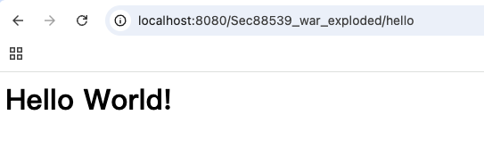
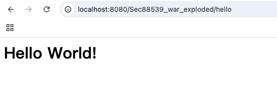
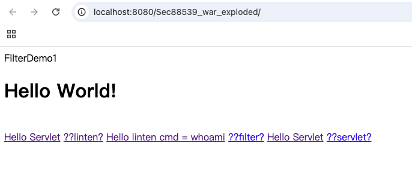
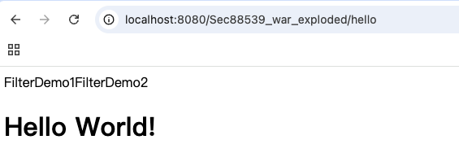
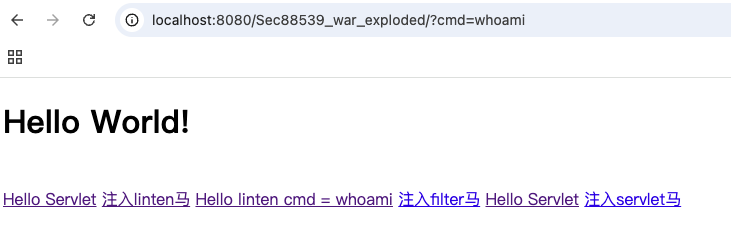
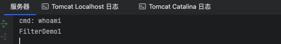

# Tomcat容器


## 第一个servlet

### 什么是servlet

`Server applet`即`运行在服务器端的小程序`

```java
import java.io.*;
import javax.servlet.http.*;

public class HelloServlet extends HttpServlet {
    private String message;

    public void init() {
        message = "Hello World!";
    }

    public void doGet(HttpServletRequest request, HttpServletResponse response) throws IOException {
        response.setContentType("text/html");

        // Hello
        PrintWriter out = response.getWriter();
        out.println("<html><body>");
        out.println("<h1>" + message + "</h1>");
        out.println("</body></html>");
    }

    public void destroy() {
    }
}
```

1. `web.xml`方式配置

```xml
<?xml version="1.0" encoding="UTF-8"?>
<web-app xmlns="http://xmlns.jcp.org/xml/ns/javaee"
         xmlns:xsi="http://www.w3.org/2001/XMLSchema-instance"
         xsi:schemaLocation="http://xmlns.jcp.org/xml/ns/javaee http://xmlns.jcp.org/xml/ns/javaee/web-app_4_0.xsd"
         version="4.0">    
    <servlet>
        <servlet-name>hello</servlet-name>
        <servlet-class>com.asset.sec88539.HelloServlet</servlet-class>
    </servlet>
    <servlet-mapping>
        <servlet-name>hello</servlet-name>
        <url-pattern>/hello</url-pattern>
    </servlet-mapping>
</web-app>
```



2. 注解配置

```java
package com.asset.sec88539;

import java.io.*;
import javax.servlet.annotation.WebServlet;
import javax.servlet.http.*;

@WebServlet(name = "HelloServlet", urlPatterns = "/hello")
public class HelloServlet extends HttpServlet {
    private String message;
    public void init() {
        message = "Hello World!";
    }
    public void doGet(HttpServletRequest request, HttpServletResponse response) throws IOException {
        response.setContentType("text/html");

        // Hello
        PrintWriter out = response.getWriter();
        out.println("<html><body>");
        out.println("<h1>" + message + "</h1>");
        out.println("</body></html>");
    }

    public void destroy() {
    }
}
```



## 第一个filter

```java
package com.asset.sec88539;

import javax.servlet.*;
import javax.servlet.annotation.WebFilter;
import java.io.IOException;

@WebFilter("/*")
public class FilterDemo1 implements Filter {
    @Override
    public void init(FilterConfig filterConfig) throws ServletException {
    }

    @Override
    public void doFilter(ServletRequest servletRequest, ServletResponse servletResponse, FilterChain filterChain) throws IOException, ServletException {
        System.out.println("FilterDemo1");
        filterChain.doFilter(servletRequest, servletResponse);
    }

    @Override
    public void destroy() {
    }
}

```

```java
package com.asset.sec88539;

import javax.servlet.*;
import javax.servlet.annotation.WebFilter;
import java.io.IOException;

@WebFilter("/hello")
public class FilterDemo2 implements Filter {
    @Override
    public void init(FilterConfig filterConfig) throws ServletException {
    }

    @Override
    public void doFilter(ServletRequest servletRequest, ServletResponse servletResponse, FilterChain filterChain) throws IOException, ServletException {
        System.out.println("FilterDemo2");
        filterChain.doFilter(servletRequest, servletResponse);
    }
    @Override
    public void destroy() {
    }
}

```






## 第一个Listener

```java
package com.asset.sec88539;

import javax.servlet.ServletRequest;
import javax.servlet.ServletRequestEvent;
import javax.servlet.ServletRequestListener;
import javax.servlet.annotation.WebListener;
import java.lang.reflect.Field;


@WebListener()
public class listenerMem implements ServletRequestListener {
    @Override
    public void requestInitialized(ServletRequestEvent sre) {
        ServletRequest req = sre.getServletRequest();
        Class reqClass = req.getClass();
        try {
            Field field = reqClass.getDeclaredField("request");
            field.setAccessible(true);
            String cmd = req.getParameter("cmd");
            if (cmd != null) {
                System.out.println("cmd: " + cmd);
            }
        } catch (Exception e) {
            throw new RuntimeException(e);
        }
    }

    @Override
    public void requestDestroyed(ServletRequestEvent sre) {
    }
}
```






## JSP

### 什么是JSP

`JSP`即`java sevlet page`

### 三种jsp代码写法与不同

```jsp
<%=  %>
```

```jsp
<% %>
```

```jsp
<%! %>
```


